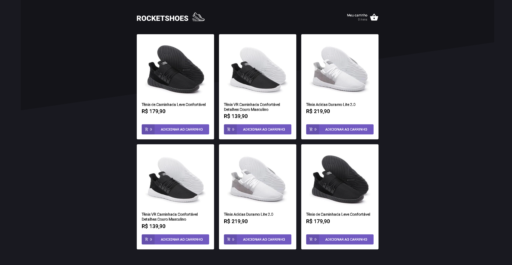
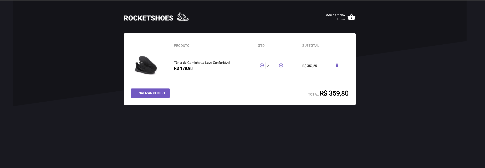

# Desafio 3 - Criando um hook de carrinho de compras

## Desafio Realizado ao término do módulo 2 do bootcamp Ignite na RocketSeat

## Tecnologias

- React
- TypeScript
- Fake API com JSON Server
- localStorage para armazenar informações no carrinho
- Toastify para exibição de erros
- Testes automatizados para validar os componentes

# Home Screen

<p align="center">
  
</p>

# Cart Screen

<p align="center">
  
</p>

O objetivo principal do desafio é criar um hook de carrinho de compras implementando as funcionalidades pedidas como:

- Adicionar um novo produto ao carrinho;
- Remover um produto do carrinho;
- Alterar a quantidade de um produto no carrinho;
- Cálculo dos preços sub-total e total do carrinho;
- Validação de estoque;
- Exibição de mensagens de erro;
- Armazenamento e busca de informações no localStorage;
- Implementação do uso de um hook personalizado

## Utilização

Após baixar o projeto pelo **git clone**, realize os seguintes passos:

### Execute os comandos abaixo:

- Instale as dependências

```console
yarn install
```

- Para iniciar o JSON Server

```console
yarn server
```

- Para iniciar o Projeto

```console
yarn start
```
